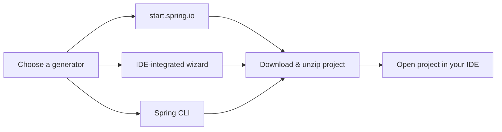

In the previous chapter, we made sure Java, an IDE, and a build tool were in place. Now let's put them to use and bootstrap your first Spring Boot project.

There are a few ways to generate a new Spring Boot project:

-   **Spring Initializr** — a web-based project generator at [start.spring.io](https://start.spring.io)
-   **IDE-integrated generator** — IntelliJ IDEA, Eclipse (with Spring Tools), and VS Code (with the Spring Boot Extension Pack) all embed the same Spring Initializr under the hood
-   **Spring CLI** — a command-line tool for generating projects, useful for scripting or quick prototypes



All three produce the exact same project — an IDE wizard is just a more convenient shortcut around Spring Initializr. We'll walk through both the web UI and the IntelliJ wizard below; pick whichever you're more comfortable with.

## Option 1: Using Spring Initializr

Head over to [start.spring.io](https://start.spring.io) and fill in the project details:

-   **Project:** Gradle - Groovy (this course uses Gradle; choose Maven if you'd rather follow along with that instead — every concept still applies)
-   **Language:** Java
-   **Spring Boot:** the latest stable version shown
-   **Project Metadata:**
    -   Group: `com.stacktips`
    -   Artifact: `hello-spring`
    -   Name: `hello-spring`
    -   Package name: `com.stacktips.hello_spring`
    -   Packaging: Jar
    -   Java: 17
-   **Dependencies:** add **Spring Web** — this pulls in everything needed to build a web application or REST API, including an embedded Tomcat server


Once everything is filled in, click **Generate**. This downloads a `.zip` file containing your project — unzip it and open the folder in your IDE.

## Option 2: Using the IntelliJ IDEA Project Wizard

If you're using IntelliJ IDEA, you don't need to leave the IDE at all. Go to **File → New → Project**, select **Spring Boot** from the project types on the left, and fill in the same metadata as above. IntelliJ generates the project directly using Spring Initializr behind the scenes and opens it for you automatically.


This is the quickest way to get started since there's no separate download-and-unzip step.

## Running the Application

Once the project is open in your IDE, give it a minute to download the dependencies defined in `build.gradle` (or `pom.xml` if you chose Maven). You can run the application in any of the following ways:

**1. From your IDE**

Open `HelloSpringApplication.java` and click the **Run** button next to the `main()` method (or use the green play icon in the toolbar).


**2. From the command line, using the Gradle wrapper**

Every project generated by Spring Initializr includes a Gradle (or Maven) wrapper, so you don't need Gradle or Maven installed separately.

```bash
# macOS / Linux
./gradlew bootRun

# Windows
gradlew.bat bootRun
```

If you generated a Maven project instead, the equivalent command is:

```bash
# macOS / Linux
./mvnw spring-boot:run

# Windows
mvnw.cmd spring-boot:run
```

**3. By building and running the packaged jar**

```bash
# macOS / Linux
./gradlew build

# Windows
gradlew.bat build
```

```bash
java -jar build/libs/hello-spring-0.0.1-SNAPSHOT.jar
```

We'll cover packaging and running Spring Boot applications in more detail in a later chapter.

## Verifying It Worked

Whichever method you used, you should see Spring Boot's startup banner in the console, ending with a line similar to:

```
Tomcat started on port(s): 8080 (http) with context path ''
Started HelloSpringApplication in 1.234 seconds
```

Now open [http://localhost:8080](http://localhost:8080) in your browser. You'll see a **Whitelabel Error Page** with a 404 status — and that's expected. It means the embedded server is up and handling requests; we just haven't defined any endpoints yet. We'll fix that when we build our first REST API later in this course.

## Summary

In this chapter, you bootstrapped your first Spring Boot project using both Spring Initializr and the IntelliJ IDEA wizard, and ran it using three different methods — from the IDE, via the Gradle wrapper, and as a packaged jar.

In the next chapter, we'll open up the project and break down exactly what each file and folder does in [Understanding Spring Boot Project Structure](/articles/understanding-spring-boot-project-structure).
