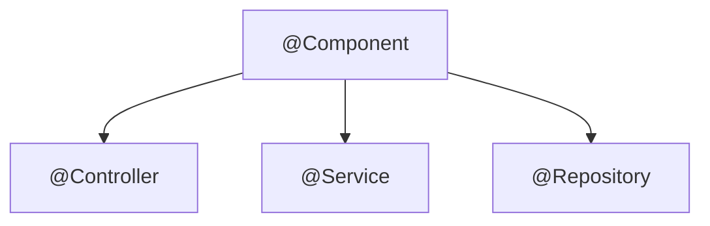

Spring Boot Annotations are metadata that provides compile time or runtime instructions to spring to decide how to wire your application together. It follows convention over configuration principle rather than XML.

In the [previous chapter](/articles/dependency-injection-in-spring-boot), we saw several of these annotations in action while learning Dependency Injection. This chapter pulls them together into one quick reference guide, and we shall preview the ones you'll meet next as we start building APIs.

## Stereotype and Bean Annotations (Recap)

These annotations register and wire up your beans — we covered each of them in detail in [Chapter 4](/articles/understanding-spring-boot-project-structure) and [Chapter 5](/articles/dependency-injection-in-spring-boot), so here's a quick reference table rather than a re-explanation:

| Annotation | What it does |
| --- | --- |
| `@SpringBootApplication` | This houses your main class. It combines `@Configuration`, `@EnableAutoConfiguration`, and `@ComponentScan` into one annotation. |
| `@Component` | Generic stereotype marking a class as a Spring-managed bean. |
| `@Service` | A specialization of `@Component` for classes that hold business logic. |
| `@Repository` | A specialization of `@Component` for classes that hold data persistence logic. |
| `@Controller` | A specialization of `@Component` for the presentation layer in Spring MVC. Spring provides another REST variant, `@RestController` used for API development.|
| `@Autowired` | Tells Spring to inject an already-registered bean — on a field, constructor, or setter. |
| `@Configuration` | Marks a class as a source of bean definitions. |
| `@Bean` | Used inside `@Configuration` class to register a custom Spring managed bean. |

The `@Controller`, `@Service`, and `@Repository` annotations are all specializations of `@Component` annotation. Spring treats them the same way at registration time, but the distinct names help developers to identify purpose of a class at glance.



Here is how we can use the `@Bean` annotation to register a Spring managed bean:

```java
@Configuration
public class AppConfig {

    @Bean
    public BeanExample beanExample() {
        return new BeanExample();
    }
}
```

## Other Commonly Used Annotations

- **`@Value`** — injects a value from your `application.properties` (or `application.yml`) file into a field, using `${property.name}` syntax. We'll use this extensively in [Chapter 7, Configuration Management](/articles/configuration-management-in-spring-boot).

```java
@Value("${app.name}")
private String appName;
```

- **`@PostConstruct`** — marks a method to run once, right after Spring has finished injecting all of a bean's dependencies. Useful for initialization logic that depends on those dependencies already being set:

```java
@Service
public class UserService {

    @PostConstruct
    public void init() {
        System.out.println("UserService is ready to use.");
    }
}
```

- **`@ControllerAdvice`** — marks a class that handles exceptions globally across all your `@Controller`/`@RestController` classes, instead of handling errors in every controller individually. We'll build one from scratch in [Chapter 19, Centralized Error Handling](/articles/centralized-error-handling-in-spring-boot-with-controlleradvice).

## Coming Up: Annotations for Building REST APIs

All of the annotations we have seen so far deal with wiring of spring beans. Let's shift our focus to some of the new set of annotation used for building REST APIs:

| Annotation | What it's for |
| --- | --- |
| `@RestController` | A `@Controller` that also assumes every method's return value should be written directly to the HTTP response body, as JSON. |
| `@GetMapping`, `@PostMapping`, `@PutMapping`, `@DeleteMapping` | Map an HTTP method and URL path to a controller method. |
| `@PathVariable` | Binds a value from the URL path (e.g., the `123` in `/users/123`) to a method parameter. |
| `@RequestParam` | Binds a query-string parameter (e.g., `?page=2`) to a method parameter. |
| `@RequestBody` | Deserializes the incoming JSON request body into a Java object. |
| `@Valid` | Triggers bean validation on a `@RequestBody` or `@PathVariable`. |

This isn't an exhaustive list of every annotation in Spring — there are many more — but these cover the ones you'll use regularly while building applications with Spring Boot.

## Summary

In this chapter, we reviewed some of the most commonly used annotations and their uses. Also we have previewed the REST-specific annotations we're about to start using in the coming chapters.

In the next chapter, we'll dig into [Configuration Management in Spring Boot](/articles/configuration-management-in-spring-boot), including a closer look at `@Value` and externalized configuration.
