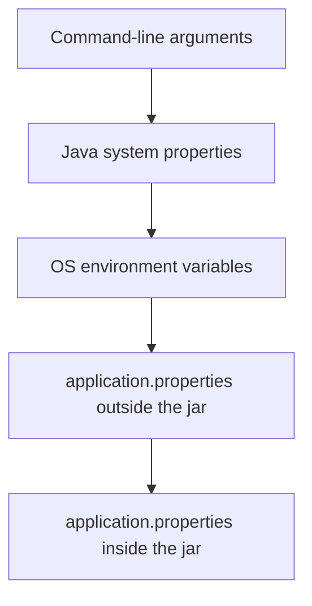

In the last chapter, we listed out the annotations you'll use all the time in Spring Boot, including `@Value`. In this chapter, we'll actually use it and see how Spring Boot loads and manages configuration for your application.

## Configuring with Properties Files

Spring Boot offers a flexible approach to managing properties from various sources. By default, it loads the properties from the `application.properties` file. It also considers the OS environment variables, Java System properties and command-line arguments.

The resources are loaded in the following order of priority, from highest to lowest:

1.  Command-line arguments
2.  Java system properties
3.  OS environment variables
4.  `application.properties` located outside the packaged application
5.  `application.properties` packaged within the application

In other words, if the same property is set in more than one place, the one higher up this list wins.



In the following example, we will create a weather service to load properties from the `application.properties` file.

1.  Add the following properties inside `application.properties` file.

```properties
weather.api.key=default-api-key
weather.default.city=New York
weather.units=imperial
```

2.  Let us create a `WeatherService` class and load the properties from `application.properties` file

```java
@Service
public class WeatherService {

    @Value("${weather.api.key}")
    private String apiKey;

    @Value("${weather.default.city}")
    private String defaultCity;

    @Value("${weather.units}")
    private String units;

    public String getWeatherForecast() {
        return String.format("Weather forecast for %s: Sunny, 25°%s. API Key: %s",
                defaultCity, units.equals("metric") ? "C":"F", apiKey);
    }
}
```

The `@Value` annotation will instruct Spring to detect and load the value of that property.

In this example, it will detect the property `weather.api.key` inside the `application.properties` file and load the value to the variable `apiKey`.

We can define a default value for the `@Value` annotation by adding a colon. Eg. `@Value("${weather.api.key:defaultKey}")`. In this case, it will use `defaultKey` as the value when there's no property defined with the key `weather.api.key`.

If there's no property defined and no default value given, it will throw the following exception:

```text
Caused by: org.springframework.beans.factory.BeanCreationException: Error creating bean with name 'weatherService': Injection of autowired dependencies failed
    at org.springframework.beans.factory.annotation.AutowiredAnnotationBeanPostProcessor.postProcessProperties(AutowiredAnnotationBeanPostProcessor.java:515) ~[spring-beans-6.1.13.jar:6.1.13]
    at org.springframework.beans.factory.support.AbstractAutowireCapableBeanFactory.populateBean(AbstractAutowireCapableBeanFactory.java:1439) ~[spring-beans-6.1.13.jar:6.1.13]
    ... omitted
Caused by: java.lang.IllegalArgumentException: Could not resolve placeholder 'weather.api.key' in value "${weather.api.key}"
```

To see the properties actually get loaded, add a `CommandLineRunner` bean that calls `getWeatherForecast()` on startup:

```java
@Component
public class AppRunner implements CommandLineRunner {

    private final WeatherService weatherService;

    public AppRunner(WeatherService weatherService) {
        this.weatherService = weatherService;
    }

    @Override
    public void run(String... args) {
        System.out.println(weatherService.getWeatherForecast());
    }
}
```

Run the app and you'll see this printed to the console:

```text
Weather forecast for New York: Sunny, 25°F. API Key: default-api-key
```

## Using `@ConfigurationProperties` Instead of `@Value`

`@Value` works fine for one or two properties, but it gets repetitive once you have a whole group of related ones, like our three `weather.*` properties. For that, `@ConfigurationProperties` is the better to bind a whole prefix straight into a class:

```java
@Component
@ConfigurationProperties(prefix = "weather")
public class WeatherProperties {

    private String apiKey;
    private String defaultCity;
    private String units;

    // getters and setters
}
```

Spring Boot maps `weather.api.key` to `apiKey`, `weather.default.city` to `defaultCity`, and so on, matching the dotted property name to the camelCase field name. You can then inject `WeatherProperties` anywhere, the same way you'd inject any other bean, instead of repeating `@Value` on every field.

## Configuring with YAML

Spring boot also natively supports YAML files for managing configuration properties. YAML files use the same principle as `.properties` files.

The application.properties file content can be written using YAML as:

**application.yaml**

```yaml
weather:
  api:
    key: default-api-key
  default:
    city: New York
  units: imperial
```

## Loading an External Configuration File

Spring Boot also picks up an `application.properties` file placed outside your project, not just the one packaged inside it. The easiest way to see this is to package the app as an executable jar and place an `application.properties` file next to it — Spring Boot will pick it up automatically without you having to point to it.

Build and run the jar:

```bash
java -jar hello-spring-0.0.1-SNAPSHOT.jar
```

If an `application.properties` file exists in the same folder as the jar, Spring Boot loads it and merges it with the one already packaged inside the jar, taking priority over it as we saw in the priority list above.

## Environment-Specific Configuration with Profiles

Spring boot also allows you to isolate the environment-specific configurations using profiles. For example, if you want to use different configurations for dev, QA and production servers, you can create 3 different files (eg. `application-dev.properties`, `application-qa.properties` and `application-prod.properties`) to have different configurations for each environment.

The profile to activate is set using the `spring.profiles.active` property. You can pass it as a command-line argument:

```bash
java -jar hello-spring-0.0.1-SNAPSHOT.jar --spring.profiles.active=dev
```

or as an environment variable:

```bash
export SPRING_PROFILES_ACTIVE=dev
```

The profile-specific `application-{profile}.properties` file takes precedence over the non-profile-specific one, but everything still follows the same overall order — a profile file doesn't outrank an environment variable or a command-line argument, only the plain `application.properties` file it's paired with.

When profile-specific properties are defined, the resources are loaded in the following order of priority, from highest to lowest:

1.  Command-line arguments
2.  Java system properties
3.  OS environment variables
4.  `application-{profile}.properties` outside the packaged application
5.  `application.properties` located outside the packaged application
6.  `application-{profile}.properties` packaged inside the application
7.  `application.properties` packaged within the application

## Overriding Configuration from the Command Line

To override configuration using the command-line arguments, you can simply add `--key=value` argument to your java -jar command.

```bash
java -jar hello-spring-0.0.1-SNAPSHOT.jar --weather.api.key=my-key
```

Command-line arguments always win — they sit at the top of every priority list we've looked at in this chapter, so they override everything else.

## Summary

In this chapter, we saw how Spring Boot loads configuration from properties files, YAML, environment variables, and command-line arguments, and in what order it picks a winner when the same property is set in more than one place. We also looked at how profiles let you swap configuration per environment.

In the next chapter, we'll look at [Logging in Spring Boot](/articles/logging-in-spring-boot), including how to control log levels per profile using what we just learned here.
