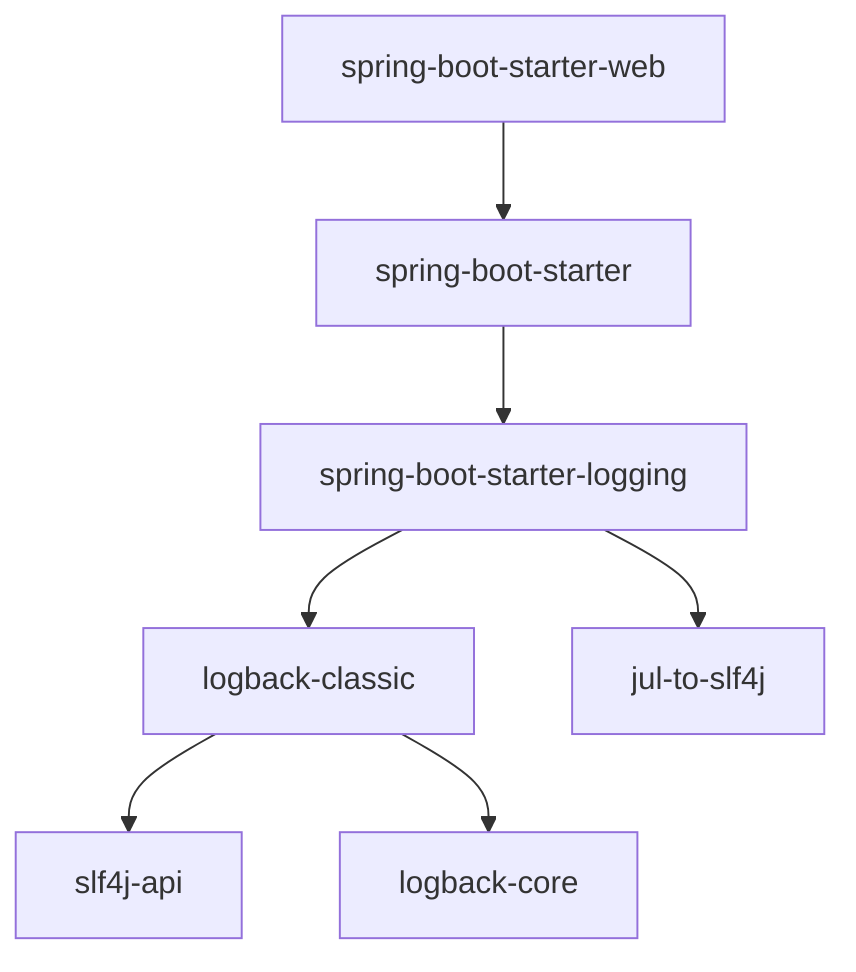
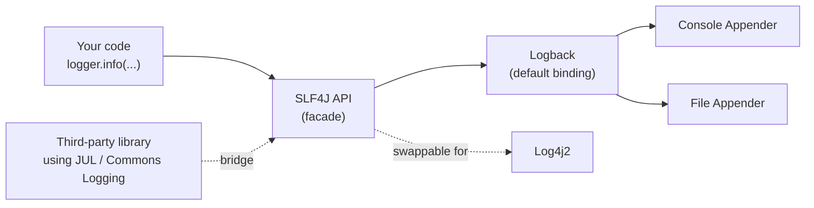

In the [previous chapter](/articles/configuration-management-in-spring-boot), we saw how Spring Boot loads configuration from properties and profiles. Logging works the same way — it's just another set of properties you set in `application.properties` file.

Logging is the process of recording events as they occur within your application. The purpose of logging is to create a record of what happened in an application. These events can be anything from errors, warnings or informational messages.

Application logs can be used for a variety of purposes, including:
-   Debugging or troubleshooting applications
-   Monitoring real-time metrics such as CPU usage, API response time, etc.
-   Auditing the activities of a Java application

## Logging in Spring Boot

Most applications provide some form of logging, and even if your application doesn't log anything directly, the dependencies used within your application will certainly log their activity.

To implement logging in your Spring Boot application, you don't have to do any additional configuration as it is built into the Spring Boot framework.

The Logging library is the only mandatory external dependency in the Spring Boot framework.

A log message generally contains the following information:
-   Date and Time: Millisecond precision and easily sortable.
-   Log Level: `ERROR`, `WARN`, `INFO`, `DEBUG`, or `TRACE`.
-   Process ID.
-   A `--` separator to distinguish the start of actual log messages.
-   Thread name: Enclosed in square brackets (Sometimes it is truncated for console output).
-   Logger name: This is usually the class name where the log is printed from
-   The log message.

### Logging Facade (SLF4J)

The logging dependencies in Spring Boot include a Simple Logging Facade (SLF4J) and the Logback framework.

The SLF4J is a simple front-facing facade supported by all major Java logging frameworks. The SLF4J provides a unified API for logging, which helps developers use the same logging API regardless of the underlying logging framework.

Applications will integrate directly with the Facade and hence it is easy to switch from one logging framework to another without breaking your implementation.

The facade includes the necessary bridges to ensure your application logs are delegated to the corresponding logging framework as per the configuration.

This is exactly the kind of thing starter dependencies handle for you, the way we saw back in [Chapter 1](/articles/introduction-to-spring-boot-framework) — adding `spring-boot-starter-web` is enough to pull in the whole logging stack transitively:



`jul-to-slf4j` is a bridge — it catches log calls made through Java's built-in `java.util.logging` (used by some third-party libraries) and routes them through SLF4J too, so everything ends up going through the same pipeline no matter which logging API a dependency happens to use internally.

### Logging Frameworks

These are some of the most popular logging frameworks used in Spring Boot:

-   Log4j
-   Logback
-   Log4j 2
-   Apache Commons Logging

All of the above frameworks are compatible with SLF4J.

Putting it all together, here's how the pieces fit at runtime:



Your code and any third-party libraries only ever talk to the SLF4J API — never to Logback directly. Logback is just the binding that happens to be plugged in by default, and it's the thing that decides where a log line actually ends up: the console, a file, or both, depending on your appender configuration. 

### Log Levels

Log levels indicate the severity/importance of the log event. Here is the list of log levels used by SLF4J:

| Log Level | Purpose |
| --- | --- |
| TRACE | Used for debugging purposes. It includes the most detailed information. |
| DEBUG | Used for debugging purposes |
| INFO | Used for the normal, expected, relevant event that happened. |
| WARN | Used to log events caused due to application anomalies, which are auto-recoverable. For example, the DB connection temporarily dropped but auto-connected during the retry. |
| ERROR | Used in the event of any fatal errors. These errors will force the administrator's intervention. These are usually used for incorrect connection strings, missing services, etc. |
| FATAL | The FATAL level designates severe error events that presumably lead the application to abort. Note that the Logback framework does not have a FATAL level. It is mapped to ERROR. |
| OFF | This is a special log level. It has the highest priority and is intended to turn off logging. |
| ALL | This is a special log level. It has the lowest priority and is intended to turn on all logging. |

## Logging an Event in Spring Boot

Let's add some log statements to our `HelloSpringApplication` class, the same one we've been building since Chapter 3:

```java
import org.slf4j.Logger;
import org.slf4j.LoggerFactory;
import org.springframework.boot.SpringApplication;
import org.springframework.boot.autoconfigure.SpringBootApplication;

@SpringBootApplication
public class HelloSpringApplication {

    private static final Logger logger = LoggerFactory.getLogger(HelloSpringApplication.class);

    public static void main(String[] args) {
        SpringApplication.run(HelloSpringApplication.class, args);

        logger.trace("TRACE message");
        logger.debug("DEBUG message");
        logger.info("INFO message");
        logger.warn("WARNING message");
        logger.error("ERROR message");
        logger.error("FATAL message");
    }
}
```

INFO is the default logging level used in Spring Boot. Hence, if we run the above code, it will only log the INFO, WARN, and ERROR events. The TRACE and DEBUG messages will be suppressed.

### Setting Log Level when Starting Application

We can enable the DEBUG or TRACE mode while starting our application using a `--debug` or `--trace` flag. Example:

```bash
java -jar build/libs/hello-spring-0.0.1-SNAPSHOT.jar --debug
```

### Setting Log Level for Spring Boot

You can specify `debug=true` or `trace=true` in your `application.properties` file to enable DEBUG or TRACE mode.

Enabling the debug mode using the above method does not configure your application to log all messages with a `DEBUG` level. It will only allow some of the core loggers inside the Spring Boot starter to log additional messages.

The application log levels can be set from the `application.properties` file using the following properties.

```properties
logging.level.root=WARN
logging.level.com.stacktips.hello_spring=TRACE
```

If you run your application, it will print as follows:

```text
2026-08-17T10:12:53.419+00:00  INFO 12345 --- [           main] c.s.h.HelloSpringApplication  : Starting HelloSpringApplication using Java 17 with PID 12345
2026-08-17T10:12:53.421+00:00 DEBUG 12345 --- [           main] c.s.h.HelloSpringApplication  : Running with Spring Boot v3.3.4, Spring v6.1.13
2026-08-17T10:12:53.422+00:00  INFO 12345 --- [           main] c.s.h.HelloSpringApplication  : No active profile set, falling back to 1 default profile: "default"
2026-08-17T10:12:54.235+00:00  INFO 12345 --- [           main] c.s.h.HelloSpringApplication  : Started HelloSpringApplication in 0.981 seconds
2026-08-17T10:12:54.238+00:00 TRACE 12345 --- [           main] c.s.h.HelloSpringApplication  : TRACE message
2026-08-17T10:12:54.238+00:00 DEBUG 12345 --- [           main] c.s.h.HelloSpringApplication  : DEBUG message
2026-08-17T10:12:54.238+00:00  INFO 12345 --- [           main] c.s.h.HelloSpringApplication  : INFO message
2026-08-17T10:12:54.238+00:00  WARN 12345 --- [           main] c.s.h.HelloSpringApplication  : WARNING message
2026-08-17T10:12:54.238+00:00 ERROR 12345 --- [           main] c.s.h.HelloSpringApplication  : ERROR message
2026-08-17T10:12:54.238+00:00 ERROR 12345 --- [           main] c.s.h.HelloSpringApplication  : FATAL message
```

### Setting Log Levels Per Profile

Since log levels are just properties, the profile files we set up in the [previous chapter](/articles/configuration-management-in-spring-boot) work for logging too — no new mechanism needed. For example, you might want verbose logs in dev but quieter ones in production:

**application-dev.properties**

```properties
logging.level.com.stacktips.hello_spring=DEBUG
```

**application-prod.properties**

```properties
logging.level.com.stacktips.hello_spring=WARN
```

Whichever profile is active decides which of these gets used, exactly as we saw with `spring.profiles.active` earlier.

### Spring Boot Log File Output

By default, all logs from Spring Boot applications are printed only to the console and do not write files. If you want to write log files in addition to the console output, you need to set the following properties:

```properties
# Log file name
logging.file.name=myapp-log.log

# It will create `spring.log` file in specified path
logging.file.path=/Users/nilanchala/Documents/logs
```

Note that, Spring considers either `file` or `path` property, not both. Log files are automatically rotated when they reach 10 MB size.

### Dynamic Log Level Changes at Runtime

Spring Boot Actuator lets you change log levels at runtime, without restarting the application — handy for debugging an issue in production without taking the app down. We'll cover Actuator in full in [Chapter 23, Working with Spring Boot Actuators](/articles/working-with-spring-boot-actuators), including how to expose and call the `/actuator/loggers` endpoint to do exactly this.

## Logging Pattern Customization

If you want to customize the log pattern, you can define your custom pattern in `application.properties` file. For example, to include the class name, method, and line number in the logs:

```properties
logging.pattern.console=%d{yyyy-MM-dd HH:mm:ss} - %highlight(%-5level) --- [%15.15thread] %cyan(%logger{40}) : %msg %n
```

This customization can include various elements, such as timestamps, log levels, thread names, logger names, and even colours for different log levels when viewed in a console that supports ANSI colours.

Spring Boot also supports MDC (Mapped Diagnostic Context) for attaching context — like a request ID or a userId — to every log line. It's most useful once you're handling concurrent HTTP requests and want to trace all the log lines that belong to one specific request, so we'll cover it properly later in the course.

## Summary

In this chapter, we covered how Spring Boot's logging works out of the box using SLF4J and Logback, the standard log levels, and how to change log levels globally, per profile, and at runtime via Actuator.

In the next chapter, we'll start building something with all of this: [Building Your First REST API with Spring Boot](/articles/building-your-first-rest-api-with-spring-boot).
